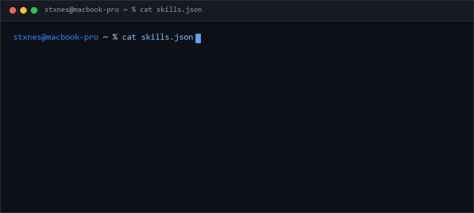

<p align="center">
  
</p>

<p align="center">
  <a href="https://github.com/STXNES">
    
  </a>
</p>

<div align="center">

```text
┌─ I CAN HELP WITH ─────────────────────────────────────────────────────────────────────────────┐
│ Active Directory & WinServer · Applied AI & RAG Agents · n8n & Process Automation · Intune   │
└───────────────────────────────────────────────────────────────────────────────────────────────┘
```

</div>

<br/>

<p align="center">
  <a href="https://www.linkedin.com/in/axro" target="_blank" style="text-decoration: none;"></a>&nbsp;&nbsp;&nbsp;&nbsp;<a href="https://github.com/STXNES" target="_blank" style="text-decoration: none;"></a>&nbsp;&nbsp;&nbsp;&nbsp;<a href="mailto:axelry2402@gmail.com" style="text-decoration: none;"></a>&nbsp;&nbsp;&nbsp;&nbsp;<a href="https://raw.githubusercontent.com/STXNES/STXNES/main/AXELL_ROJAS_CV.pdf" target="_blank" title="Download CV Axell Rojas (PDF)" style="text-decoration: none;"></a>
</p>

<br/>

---

## 🖥️ System Status & Specs

```text
             g@M%@%%@N%Nw,,             axell@stxnes ---------------------------------------
          ,M*`||*%gNM=]mM%g||%N,        . OS: ................ Windows Server, Linux, Win11, iOS
         p!`   '!```''''|||jhlj%w       . Role: .............. Systems Administrator & AI Specialist
       ,@L  ,,        ''`|j%M]%M        . Education: ......... B.S. Systems Engineering @ Fidélitas
      j]`  .,      ,     ''''|%Wg       . Kernel/Focus: ...... IT Infra + Agentic AI (RAG, LangGraph)
     /{||]@████████pp.      |||||       . IDE/Tools: ......... VS Code, VMware, Hyper-V, n8n, Docker
    , `]@@@@@@@@@@@@@@p  ,              . Lang.Coding: ....... Python, C#, SQL, PowerShell, Bash
   ,  :]%%@@@@%%%%%%k%h '*||mkr   *     . Lang.Web/Data: ..... HTML5, CSS3, JSON, REST APIs
   '   j%M`      |jkk'  ~nrn=|i  ;      . Lang.Real: ......... Spanish (Native), English (B1/Tech)
   !  jrr*^`           `"!  L'':!       
    j  lp;,.  ,/ @@    ,;\nmy  ,~       - Certifications -----------------------------------
   i r @@mmHM @@@@ ~*****M*,p ;,        . SC-300: ............ Identity & Access Admin (Completed)
   | ]@@@@HHH]g@M%%%%H,jmgpmb% j        . MD-102: ............ Endpoint Admin (Completed)
   ;;%%%%k%@[,.n|;.;j%%k|k%%',['        . Cisco: ............. CCNA (Completed)
    H|%%k%%%j%k||,;;j;!!'|ij}]@         . ONE/Oracle: ........ Tech AI Builder (Completed)
   "djjmkL,"]] [,,,,wwxw;|#kjk`         . CompTIA: ........... A+ Professional Prep (Completed)
    %;%km%%%M%M|%%jkkii|||[             . Cloud: ............. Google Cloud Foundations (Completed)
      kjj%%kkkl!||||||j|||`             
       |jmH@@@b%%kkmk%i!,[              - Contact ------------------------------------------
       @p|j%%%jkk|||j*'`;[              . Email: ............. axelry2402@gmail.com
       ]@@@g|''''`  ,,;j%k              . LinkedIn: .......... linkedin.com/in/axro
       @@@@@mgmp,,,,,;;jj%%k%           . GitHub: ............ github.com/STXNES
     - `%%%@@@%%kgki!|jjjjk%k%@         
   .^[' %@@@@HH%b%k{illljkjj%%%% ; `,   ----------------------------------------------------
   =['`  .%HH%%%%H@gkilljjj%kk%".   `i   
```

<br/>

---

## ⚡ Technical Profile Overview

<p align="center">
  
</p>

<br/>

---

## 🛠️ Main Skills & Technologies

### 🖥️ Systems, Infrastructure & Identity
<p>
  
  
  
  
  
  
  
  
</p>

### 🤖 Applied AI, Agents & Automation
<p>
  
  
  
  
  
  
  
</p>

### 📜 Certified & Completed Training
<p>
  
  
  
  
  
  
</p>

<br/>

---

## 📂 Featured Home Labs & AI Projects

### 🔹 1. Enterprise Windows Server 2022 Lab (VMware)
> **Simulated Corporate Infrastructure**
- **Domain Controller & Client Workstation** virtualized in VMware Workstation Pro.
- **Active Directory Domain Services (AD DS)** configured with structured OUs, security groups, and centralized user management.
- **Group Policy Objects (GPOs)** implemented for security baselines, privilege control, and workstation restrictions.
- **Network Services**: Integrated DNS, DHCP, and CPU/RAM allocation tuning across VMs.

### 🔹 2. HR Process Automation Assistant (RAG + n8n)
> **Oracle Next Education (ONE) Project**
- Workflow automation built using **n8n** connected to a **Retrieval-Augmented Generation (RAG)** pipeline.
- Contextual document retrieval powered by **Cohere embeddings** and **PostgreSQL (Neon)** vector storage.
- Natural language conversational support integrated directly with **Telegram** via REST APIs.

### 🔹 3. Alura Intelligent Document Q&A Agent
> **Challenge Alura Latam**
- Intelligent document assistant powered by **LangChain** and **FAISS vector store**.
- Enables natural language Q&A across internal business documents (PDF/CSV) with exact page/row source citations.
- Containerized with **Docker**, deployed on **Oracle Cloud Infrastructure (OCI)** Compute, with a **Streamlit & FastAPI** UI.

<br/>

---

## 💼 Experience Highlight

**Technician Operator** | *Intel Corporation, Costa Rica* (2023 – 2025)
- Operated TSX-certified die-attach equipment for server chipset production under strict thermal, vacuum, and gas parameters.
- Proactively monitored process metrics via process-control software to prevent equipment failures and sustain 24/7 line continuity.
- Managed shift passdowns, calibrations, and error resolution under strict ITIL/SOP/SLA frameworks.
- Sustained consistent performance and attention to detail through 4x3 rotating night shifts in a high-pressure shared work-cell with engineers and technicians.

<br/>

---

## 📊 GitHub Analytics

<p align="center">
  
  &nbsp;&nbsp;
  
</p>

<br/>

<p align="center">
  
</p>
